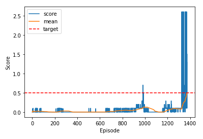

# Report

## The result

The agents were able to solve the environment in 1375 episodes. The max reward over both agents was 0.58688 over 100 consecutive episodes.

## The algorithm

For this project I used a little addapted version of the MADDPG-Algorithm (Multi Agent Deep Deterministic Policy Gradient)

### Overall description

In order to fullfill the task I use a multi-agent-actor-critic approach. My implementation works with 2 seperate neural networks for each agent. One for the actor 
and one for the critic. Both architectures can be seen underneath. It also uses the target network approach. To update the target networks a soft update function is used.
Additionally the used algorithm is an off-policy algorithm, which means it uses a Replay Buffer to store previous interactions and learn from them. All information of the step including the actions of both agents are stored in one sample. It's important to mention, that the existence of multiple agents with differnt policys could cause instationarity of the environment. 
This could lead to poorly performing agents and instability in learning. To solve this problem the critic of every single agent knows also about the policys and actions of the other agents and could use this information two calculate the Q-value. In Code this is done by adding the actions of every agent to the input of the critic network.

### Net Architecture

### Actor

The actor-network is a simple feed-forward network

Input: The state of the environment

Output: The action to take

>Input Layer: 24 Nodes (state size)

>First Hidden Layer (ReLu): 128 Nodes

>Batch-Normalization-Layer

>Second Hidden Layer (ReLu): 128 Nodes

>Output Layer (tanh): 2 Nodes (action size)

### Critic

The critic-network is a simple feed-forward network.

Input: The state of the environment + actions of the first agent + actions of the second agent
Output: Q-value

>Input Layer: 28 Nodes (state size + 2*action size)

>First Hidden Layer (ReLu): 128 Nodes

>Batch-Normalization-Layer

>Second Hidden Layer (ReLu): 128 Nodes

>Output Layer (tanh): 1 Node

(It's important to mention that concating the actions in the first layer causes a bost in performance of the implementation)

### Hyperparameters

>Learning Rate (Actor):   1e-4

>Learning Rate (Critic):  5e-3

>Discount Rate:           0.995

>Noise Decay:             0.999

>Softupdate Rate:         1e-3

>Random Seed:             1

### Pseudo-Code

In pseudocode the MADDPG-Algorithm looks like following:

## Annotation

In my opinon it's important to mention, that due to the randomness of the first episodes the repeteability of the porject is only partly given. The actions taken in the first few episodes have a very high impact on the trainings duration. In numbers I got several trainings which needed over 3000 episodes to train but also some that needed only round about 1000.

## Future Ideas

Allthough the result with this algorithm fullfill all necessary requirements, there are a few more things I like to try. At first I want to know what the maximum for this Code is. So I like to adjust the hyperparameters network-architectueres and give it some more trys. Additionaly I like to try Prioritized Experience Replays, witch could improve the learning effects gained from previous interactions.
